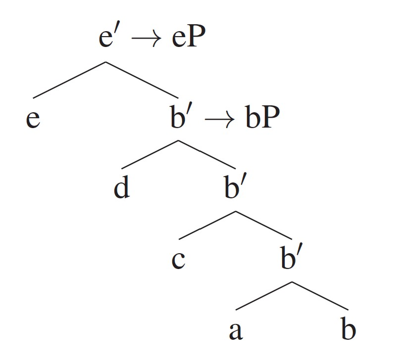
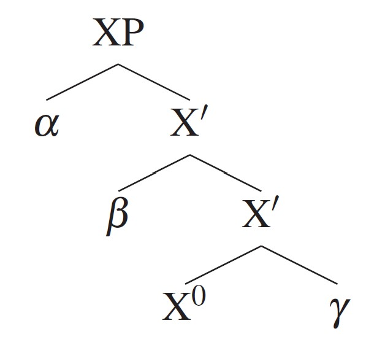
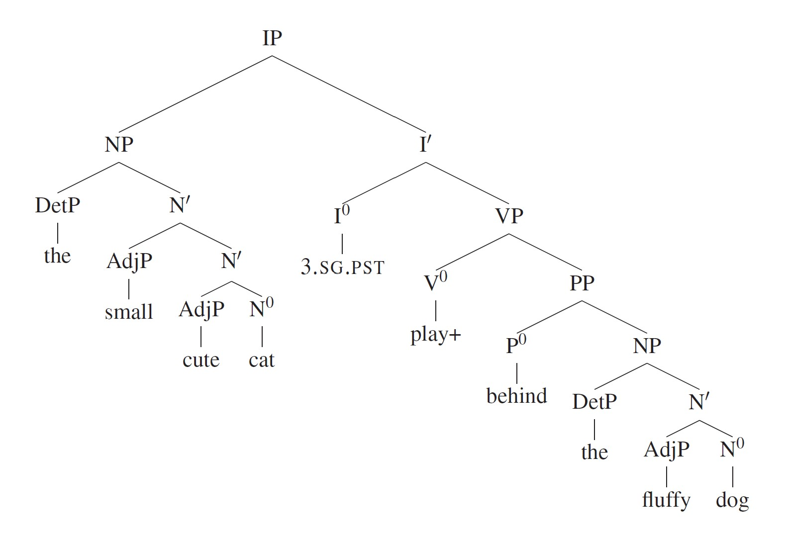

# 句法基础 :book:

## 检验成分的测试方法 Constituency Tests 
- 替代法 Substitution
- 移位法 Movement
- 部分问答法 Questions/Fragment Answers

Note1: 通过检验的一定是成分，不通过检验的有可能是成分。（例子招标😆）

（1）我**<u>的</u>**书包落在教室了。

Note2: 词是成分。

## 结构关系 Structural Relations
- 支配 Dominance
    - 节点α支配节点β当且仅当存在从α到β的下行通路。
- 母女节点/姐妹节点 Mothers/Daughters/Sisters
    - 节点α是节点β的母节点当且仅当α直接支配β，称β为α的子女节点。
    - β和γ是姐妹节点当且仅当β和γ有共同的母节点α.
- 终端节点 Terminal Nodes
    - 节点α是终端节点当且仅当α没有子女节点。
- 彻底支配 Exhaustive Dominance
    - 节点α支配字符串S当且仅当
        - i. 节点α彻底支配所有终端t∈S
        - ii. 不存在被α支配的t'∉S
- 成分 Constituents 
    - 成分是由单一节点彻底支配的字符串。

Note：句法学目前假设语言层级结构中只使用二叉树。

## 合并 Merge
### 什么是合并？
- 句法树由重复利用句法学家称作“合并”的操作建构起来。
- 合并操作利用两个元素α和β形成一个二叉成分。
- α和β可以是词，也可以是合并操作输出的更大成分，也可以一个是词，另一个是更大的成分。
### 合并形成的成分如何命名？
- X = Merge(a, b)，X是a或b的投射，也就是说，a或b的部分性质或特征会传给X.
- x'的概念意味着x的性质由更低的节点投射而来。

- 当该性质停止向上投射时，我们称相关的最高投射为“最大投射（Maximal Projection）”或“短语（Phrase）”。
- 中心（Head）是终端节点（词，或者比词更小的元素），换句话说，合并得到的成分不能作为中心。
- 成分α的中心是终端节点x当且仅当x决定α的性质。
- 我们将中心表记为X0，最大投射为XP，其他中间投射为X’。

## X’-结构
- X0是最大投射XP的中心。
- 忽视左右：α和/或β也可以出现在X’的右边，类似地，γ可以出现在X0左边。 
- 原则上可以有很多层X’。
- α、β和γ必定是最大投射。
- 我们称X0的姐妹节点为X0的补充语（Complement）。（γ）
- 我们称最高X’的姐妹节点为XP的标志语（Specifier）。(α)
- 如果合并的成分既不是标志语也不是补充语，那么它是附接（Adjunct）。(β)

- 当动词和NP（名词短语，Noun Phrase）合并时，动词向上投射。
  - 输出成分不能像NP一样作句子主语或宾语，但像动词一样可以作谓语。
- 我们认为，句子本身是IP，中心I0或称Inflection携带时态与一致特征。

